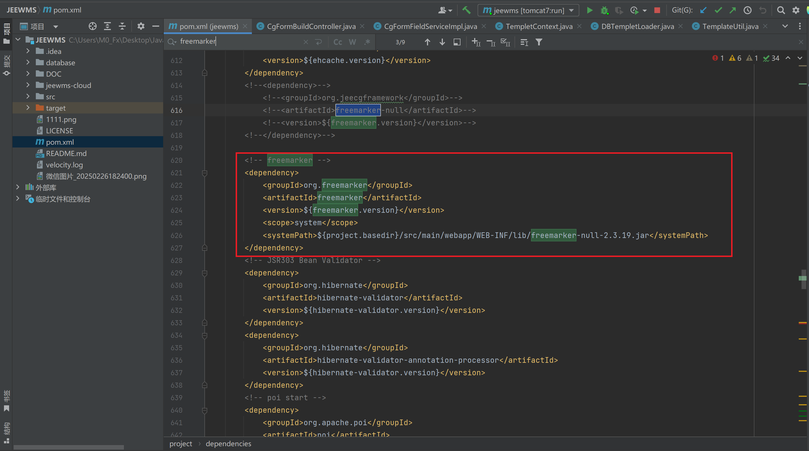
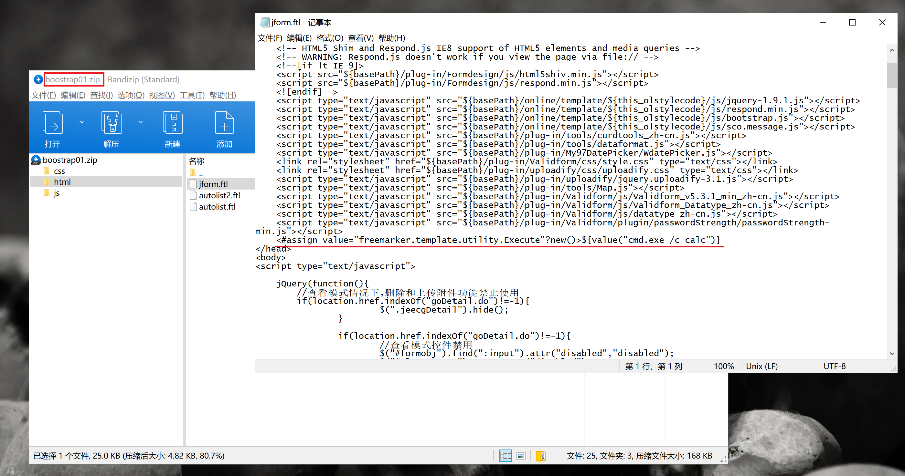
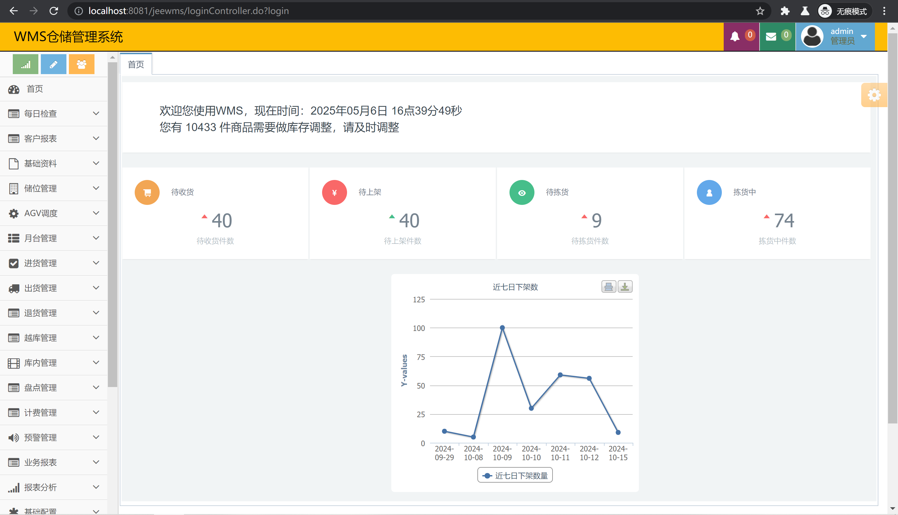
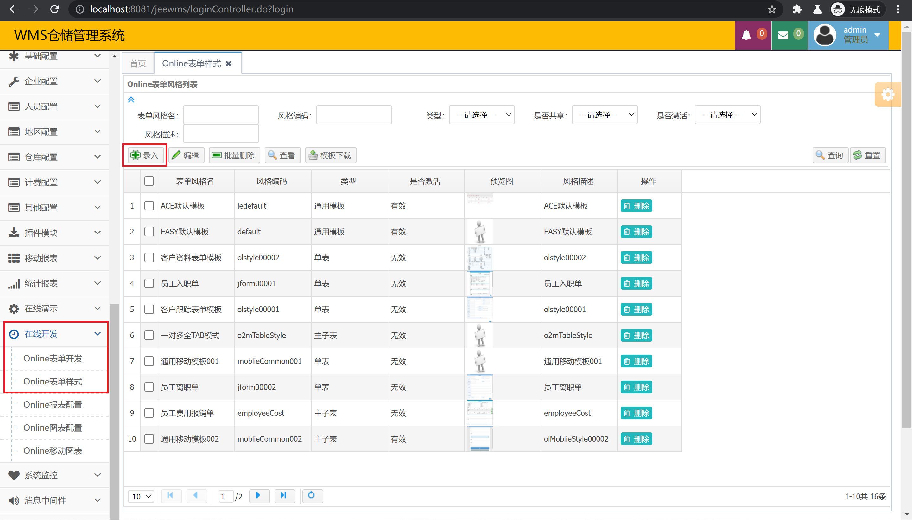
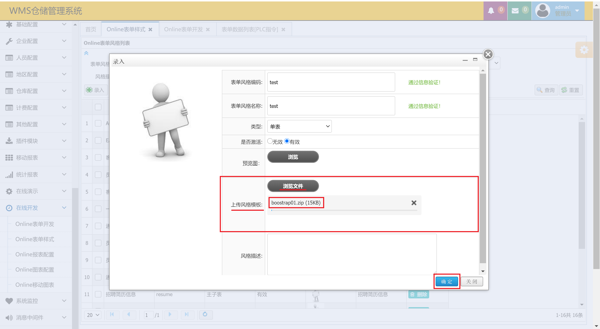
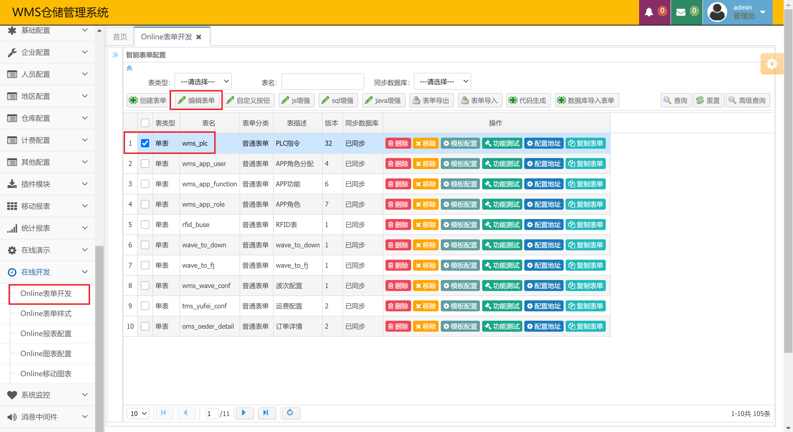
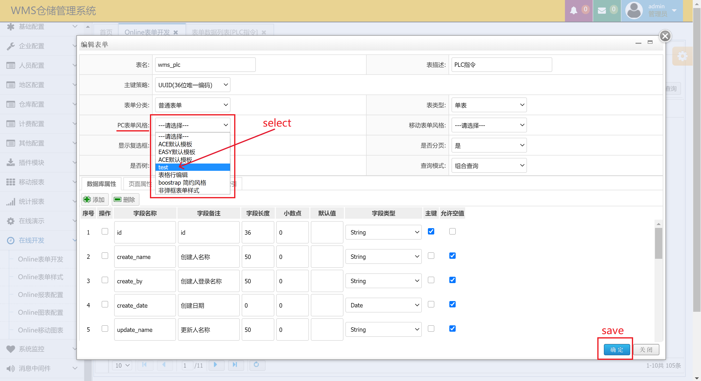
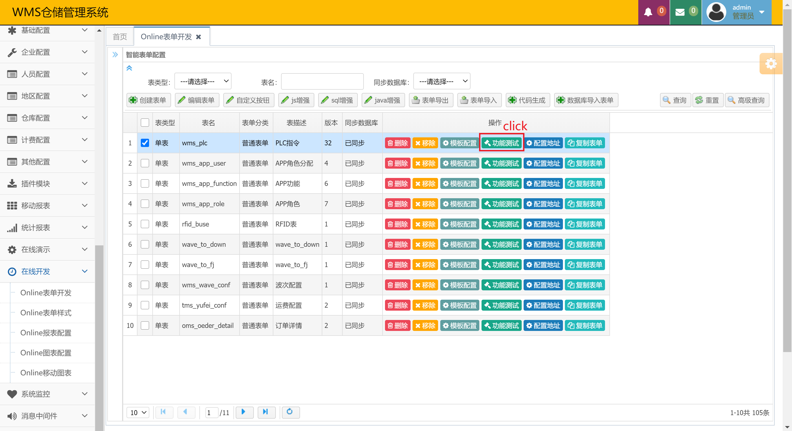
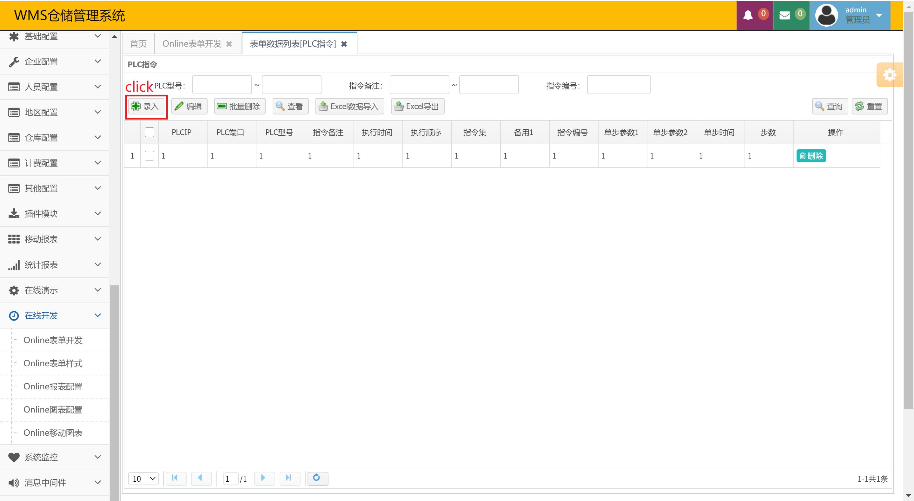
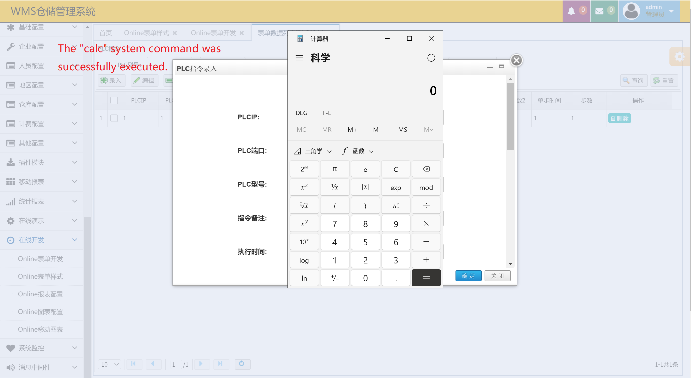

# The JeeWMS-v3.7 system has a background SSTI vulnerability that causes RCE

  JeeWMS version : < = v3.7, vulnerable to background SSTI attacks, allowing attackers to execute remote commands.
  
  Project source code address:https://gitee.com/erzhongxmu/JEEWMS

#### Step 1:
  Through the configuration file ' pom.xml ' file, it can be seen that the back-end uses the freemarker template framework. So make a template file with payload and compress it.

```
# payload
<#assign value="freemarker.template.utility.Execute"?new()>${value("cmd.exe /c calc")}
```





#### Step 2:
  After the JeeWMS system is deployed locally, it enters the system background.



#### Step 3:
  Find the 'Online表单样式' function in the '在线开发' column in the left function bar and open it.After opening, click the '录入' button to create a new form style.



#### Step 4:
  Click '浏览文件' at the '上传风格模板' of the creation interface to select the prepared template archive file and click the '确定' button to upload.



#### Step 5:
  After the upload is completed, open the 'Online表单开发' function, tick any form, and click the '编辑表单' button. Then select the previously created style template in the open interface 'PC表单风格'.





#### Step 6:
  After saving the modifications, click the '功能测试' button of the corresponding form, and then click the '录入' button to trigger the payload completion command execution.







#### Demo video
http://47.99.62.25:47619/JeeWMS-SSTI.mp4

